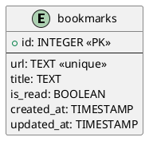

# データベース設計ドキュメント

## 概要

URLとそのメタデータを保存するためのシンプルなデータベース設計です。
SQLiteをベースに設計しています。

## テーブル定義

### bookmarks テーブル

| カラム名    | データ型    | NULL許可 | デフォルト | 説明                    |
|------------|------------|----------|------------|------------------------|
| id         | INTEGER    | NO       | -          | 主キー（自動採番）      |
| url        | TEXT       | NO       | -          | ブックマークされたURL    |
| title      | TEXT       | YES      | NULL       | URLから取得したタイトル  |
| is_read    | BOOLEAN    | NO       | false      | 読んだかどうかのフラグ   |
| created_at | TIMESTAMP  | NO       | CURRENT_TIMESTAMP | 作成日時      |
| updated_at | TIMESTAMP  | NO       | CURRENT_TIMESTAMP | 更新日時      |

#### インデックス
- PRIMARY KEY (id)
- UNIQUE INDEX idx_bookmarks_url (url)
- INDEX idx_bookmarks_created_at (created_at)
- INDEX idx_bookmarks_is_read (is_read)

## ER図

## 補足説明

### テーブル・カラムの説明

#### bookmarks テーブル
- メインとなるテーブルで、URLとそのメタデータを保存します
- `id`: レコードの一意識別子
- `url`: ブックマークされたURLを保存。重複を防ぐためユニーク制約を設定
- `title`: URLのメタデータから取得したタイトル。取得できない場合はNULLを許容
- `is_read`: ユーザーがそのURLを読んだかどうかを示すフラグ
- `created_at`: レコード作成日時
- `updated_at`: レコード更新日時

### 設計上の考慮点

1. シンプルな設計
   - ユーザー管理が不要なため、単一のテーブルで要件を満たすことができます
   - 将来の拡張性を考慮しつつ、現時点では必要最小限の構造を維持

2. パフォーマンスとインデックス
   - URLに対するユニーク制約により重複登録を防止
   - created_atにインデックスを作成し、時系列での検索を最適化
   - is_readにインデックスを作成し、未読/既読での検索を最適化

3. 保守性
   - updated_atを設けることで、データの更新履歴を追跡可能
   - 標準的なデータ型を使用し、互換性を確保