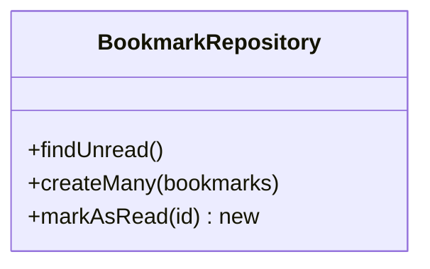
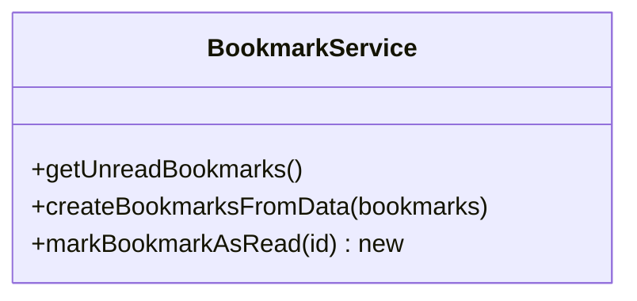
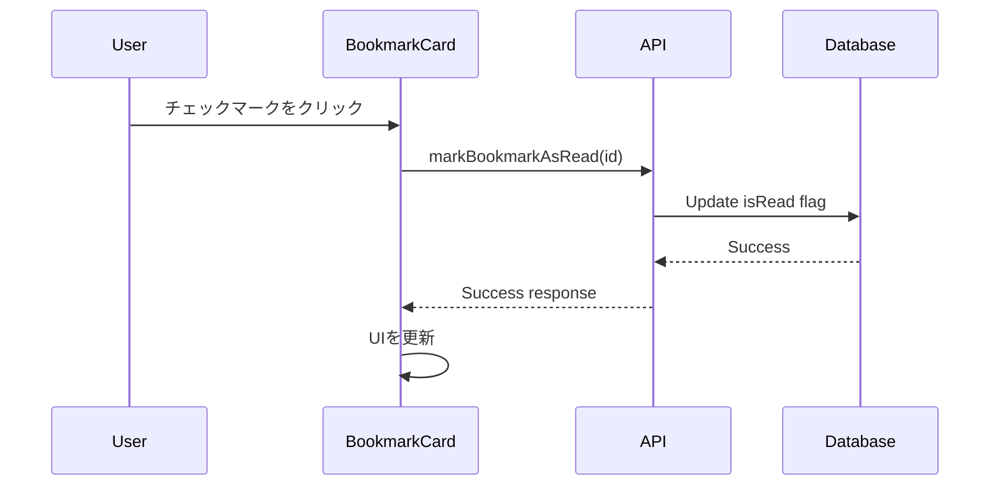

# 既読機能の実装計画

## 1. APIの実装

### データベース操作（Repository層）


### ビジネスロジック（Service層）


### API エンドポイント
- 新規エンドポイント: `PATCH /api/bookmarks/{id}/read`
  - パラメータ: bookmarkId（パスパラメータ）
  - レスポンス: 成功時は200、失敗時は適切なエラーコード

## 2. フロントエンドの実装

### コンポーネントの変更


### APIクライアントの変更
- `src/lib/api/bookmarks.ts`に`markBookmarkAsRead`メソッドを追加
  ```typescript
  export async function markBookmarkAsRead(id: number): Promise<void>
  ```

### UIコンポーネントの変更
- `BookmarkCard`コンポーネントに以下を追加:
  - チェックマークアイコン（Heroiconsを使用）
  - クリックハンドラー
  - 既読状態のスタイリング

## 3. テスト計画
1. APIのユニットテスト
   - Repository層のテスト追加
   - Service層のテスト追加
   - エンドポイントのテスト追加

2. フロントエンドのテスト
   - `BookmarkCard`コンポーネントのテスト追加
   - APIクライアントのテスト追加

## 4. 実装手順
1. APIの実装
   1. Repository層の実装
   2. Service層の実装
   3. エンドポイントの実装
   4. テストの実装

2. フロントエンドの実装
   1. APIクライアントの実装
   2. `BookmarkCard`コンポーネントの更新
   3. テストの実装