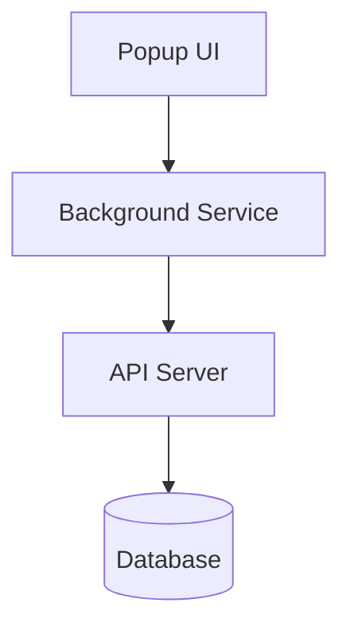

# System Patterns

## アーキテクチャ概要
クライアントサイド（Chrome拡張機能）とサーバーサイド（Cloudflare Workers）の2つの主要コンポーネントで構成。

## コンポーネント構成

### 1. Chrome拡張機能
#### Popup (UI層)
- タブ一覧表示と選択インターフェース
- ユーザーアクション処理
- 状態表示とフィードバック

#### Background Service（サービス層）
- APIとの通信処理
- メッセージングの管理
- エラーハンドリング

### 2. APIサーバー
- ブックマークの一括保存処理
- データベース操作の抽象化
- レスポンス形式の標準化

## 設計パターン

### 1. Event-Driven Architecture
- Chrome拡張機能内でのメッセージング
- イベントベースの状態更新

### 2. Service Pattern
- Background Serviceによる外部通信の抽象化
- 関心の分離

### 3. Repository Pattern（API側）
- データアクセスの抽象化
- ビジネスロジックとデータ永続化の分離

## データフロー
1. ユーザーアクション（UI）
2. イベント発火
3. Background Serviceによる処理
4. API通信
5. データベース操作
6. レスポンス返却
7. UI更新
