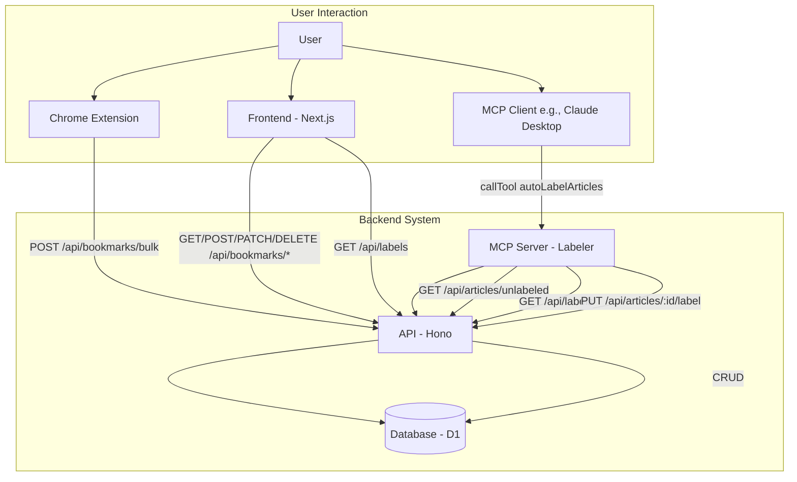
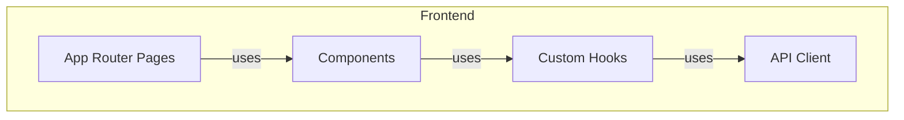
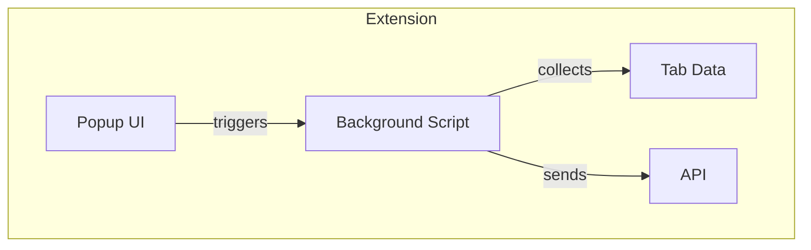

# システムパターン

## アーキテクチャ概要



## コンポーネント構成

### フロントエンド（Next.js）



- **レイヤー構造**
  - Pages: ルーティングとレイアウト
  - Components: UI表示とユーザー操作
  - Hooks: ビジネスロジックと状態管理
  - API Client: バックエンドとの通信

### バックエンド（Hono）

```mermaid
graph TD
    subgraph Backend
        subgraph Routes
            BookmarksRoute[/api/bookmarks]
            LabelsRoute[/api/labels]
        end
        subgraph Services
            BookmarkService
            LabelService
        end
        subgraph Repositories
            BookmarkRepository
            LabelRepository
            ArticleLabelRepository
            FavoriteRepository
        end
        subgraph Schema
            BookmarksTable[bookmarks]
            FavoritesTable[favorites]
            LabelsTable[labels]
            ArticleLabelsTable[article_labels]
        end

        Routes -->|uses| Services
        Services -->|uses| Repositories
        Repositories -->|uses| Schema
    end
```

- **レイヤー構造**
  - Routes: エンドポイント定義 (`/api/bookmarks`, `/api/labels`)
  - Services: ビジネスロジック (`BookmarkService`, `LabelService`)
  - Repositories: データアクセス (`BookmarkRepository`, `LabelRepository`, `ArticleLabelRepository`, `FavoriteRepository`)
  - Schema: データモデル定義 (`bookmarks`, `favorites`, `labels`, `article_labels` テーブル)

### 拡張機能（Chrome Extension）



- **コンポーネント**
  - Background: タブデータ収集とAPI通信
  - Popup: ユーザーインターフェース

## 設計パターン

### Repository Pattern (API)
- データアクセスをカプセル化
- SQLクエリをRepositoryに集約
- Serviceは抽象化されたインターフェースを使用

### Custom Hook Pattern (Frontend)
- ビジネスロジックをフックに分離
- 状態管理とAPIコールを統合
- コンポーネントはUIに専念

## データフロー

### ブックマーク保存フロー (Extension)
1. 拡張機能がタブ情報を収集
2. API (`POST /api/bookmarks/bulk`) にリクエスト
3. `BookmarkService` が重複チェック等を行い `BookmarkRepository` を呼び出す
4. `BookmarkRepository` が `bookmarks` テーブルにデータを保存

### ブックマーク取得フロー (Frontend)
1. フロントエンドがAPI (`GET /api/bookmarks` or `GET /api/bookmarks/favorites` etc.) にリクエスト
2. `BookmarkService` がリクエストに応じて `BookmarkRepository` を呼び出す
3. `BookmarkRepository` が `bookmarks`, `favorites`, `labels`, `article_labels` テーブルを結合してデータを取得
4. Serviceがデータを整形してフロントエンドに返す
5. UIに表示

### ラベリングフロー (MCP Server)
1. MCP Client (e.g., Claude Desktop) が MCP Server の `autoLabelArticles` Tool を呼び出す
2. MCP Server が API (`GET /api/articles/unlabeled`, `GET /api/labels`) にリクエスト
3. API が未ラベル記事と既存ラベル一覧を返す
4. MCP Server が各記事に対してラベルを判断 (現在はダミーロジック、将来的にはLLM連携)
5. MCP Server が API (`PUT /api/articles/:id/label`) にリクエスト
6. API の `LabelService` がラベルの存在確認・新規作成、`ArticleLabelRepository` を呼び出し紐付け
7. `ArticleLabelRepository` が `article_labels` テーブルにデータを保存
8. MCP Server が処理結果を MCP Client に返す

## テスト戦略

### APIテスト
- ユニットテスト優先
- 層ごとの分離テスト
- 90%以上のカバレッジ維持

### フロントエンド
- 現状テスト省略
- 将来的に重要コンポーネントのみテスト検討

## 主要な技術的決定

### Cloudflare採用理由
- ゼロコストで運用可能
- エッジでの高速な応答
- D1によるSQLiteサポート

### Next.js採用理由
- App Routerによる最新機能
- TailwindCSSとの相性
- Cloudflareデプロイ対応

### Hono採用理由
- 軽量で高速
- TypeScriptフレンドリー
- Cloudflare Workers対応
