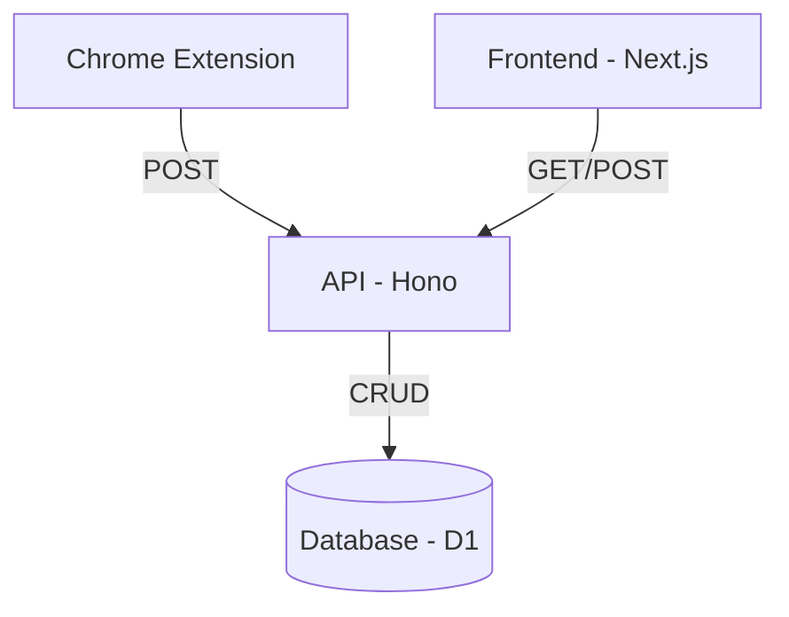
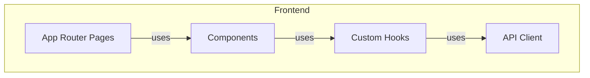
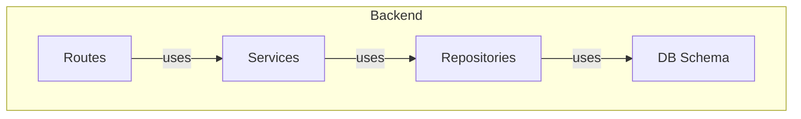
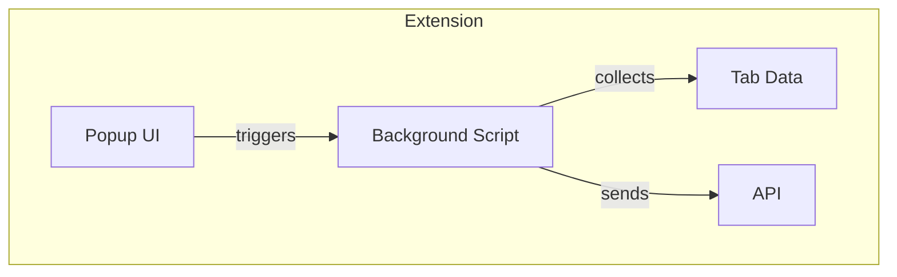

# システムパターン

## アーキテクチャ概要

## コンポーネント構成

### フロントエンド（Next.js）

- **レイヤー構造**
  - Pages: ルーティングとレイアウト
  - Components: UI表示とユーザー操作
  - Hooks: ビジネスロジックと状態管理
  - API Client: バックエンドとの通信

### バックエンド（Hono）

- **レイヤー構造**
  - Routes: エンドポイント定義
  - Services: ビジネスロジック
  - Repositories: データアクセス
  - Schema: データモデル定義

### 拡張機能（Chrome Extension）

- **コンポーネント**
  - Background: タブデータ収集とAPI通信
  - Popup: ユーザーインターフェース

## 設計パターン

### Repository Pattern (API)
- データアクセスをカプセル化
- SQLクエリをRepositoryに集約
- Serviceは抽象化されたインターフェースを使用

### Custom Hook Pattern (Frontend)
- ビジネスロジックをフックに分離
- 状態管理とAPIコールを統合
- コンポーネントはUIに専念

## データフロー

### ブックマーク保存フロー
1. 拡張機能がタブ情報を収集
2. APIにPOSTリクエスト
3. Repositoryがデータを保存
4. フロントエンドに反映

### ブックマーク取得フロー
1. フロントエンドがAPIにリクエスト
2. Serviceがデータを処理
3. UIに表示

## テスト戦略

### APIテスト
- ユニットテスト優先
- 層ごとの分離テスト
- 90%以上のカバレッジ維持

### フロントエンド
- 現状テスト省略
- 将来的に重要コンポーネントのみテスト検討

## 主要な技術的決定

### Cloudflare採用理由
- ゼロコストで運用可能
- エッジでの高速な応答
- D1によるSQLiteサポート

### Next.js採用理由
- App Routerによる最新機能
- TailwindCSSとの相性
- Cloudflareデプロイ対応

### Hono採用理由
- 軽量で高速
- TypeScriptフレンドリー
- Cloudflare Workers対応
