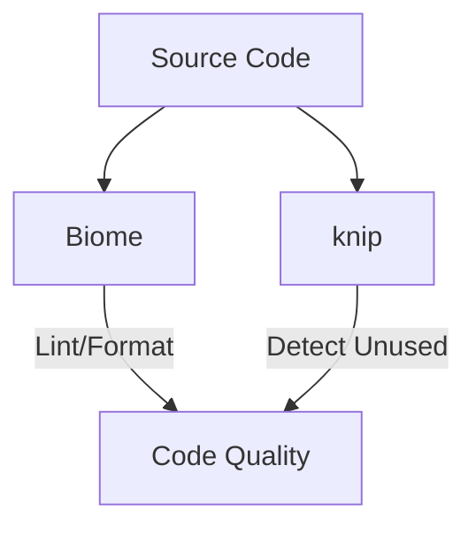
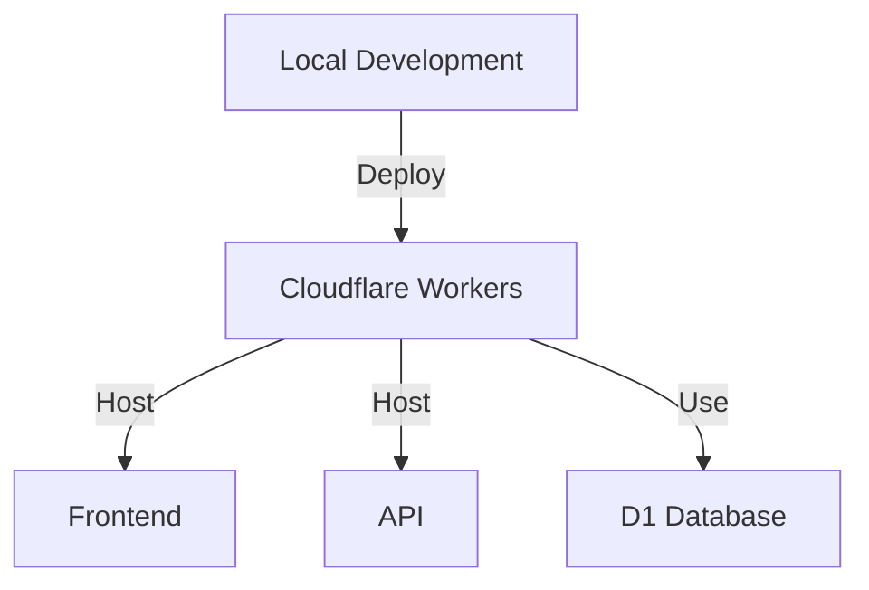

# 技術コンテキスト

## 開発環境

### ランタイム
- Bun
  - 高速な実行速度
  - TypeScriptのネイティブサポート
  - パッケージマネージャとしても使用

### 静的解析

- Biome
  - リンティング
  - フォーマッティング
  - CIでの自動検証

- knip
  - 未使用コードの検出
  - 依存関係の分析
  - CIでの自動検証

### テスト環境
- Vitest
  - 高速な実行
  - Watch mode対応
  - カバレッジレポート

## デプロイメント設定

### Cloudflare Workers

- フロントエンド
  - Next.js + OpenNext
  - 自動的に割り振られたドメイン使用
  - エッジでの高速な応答

- API
  - Hono
  - D1（SQLite）との統合
  - エッジでの低レイテンシー

### 拡張機能
- ローカルインストール
- `chrome://extensions/`で読み込み
- 開発モードでの動作確認

## 依存関係管理

### フロントエンド
- Next.js: ^14.0.0
- TailwindCSS: ^3.0.0
- @opennextjs/cloudflare: ^0.10.0

### バックエンド
- Hono: ^3.0.0
- Drizzle ORM: ^0.29.0
- Cloudflare D1: Beta

### 開発ツール
- Biome: ^1.0.0
- knip: ^3.0.0
- Vitest: ^1.0.0

## 技術的制約

### Cloudflare Workers
- 実行時間制限: 50ms
- メモリ制限: 128MB
- 同時接続数制限

### D1 Database
- トランザクション制限
- クエリの複雑さ制限
- データ容量制限

### 拡張機能
- Manifest V3の制約
- バックグラウンド実行時間制限
- APIコール制限

## 開発フロー

### ローカル開発
1. `bun install`で依存関係インストール
2. `bun run dev`で開発サーバー起動
3. `bun test`でテスト実行

### CI/CD
1. Push時の自動テスト
2. PRでの静的解析
3. マージ後の自動デプロイ

### コード品質管理
- Biomeによる自動フォーマット
- knipによる依存関係チェック
- テストカバレッジ90%以上維持
