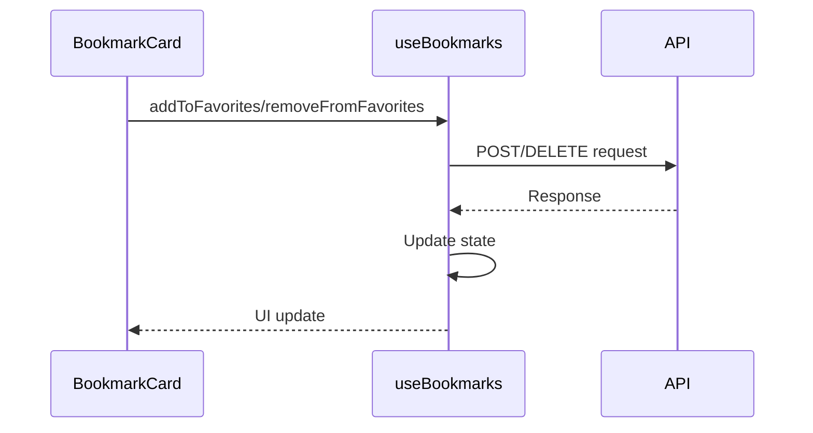
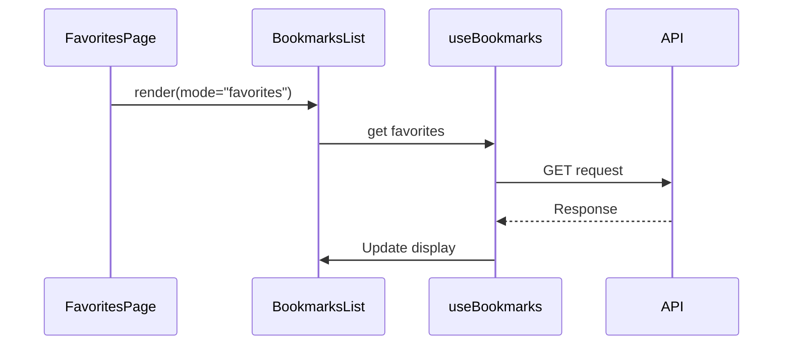

# フロントエンド設計

## コンポーネント構成

### 1. BookmarkCard
お気に入りボタンを含むブックマークカードのコンポーネント

```typescript
interface Props {
  bookmark: Bookmark;
  onUpdate?: () => void;
}

export function BookmarkCard({ bookmark, onUpdate }: Props) {
  const [isFavoriting, setIsFavoriting] = useState(false);
  
  // お気に入りトグル処理
  const handleFavoriteToggle = async () => {
    try {
      setIsFavoriting(true);
      if (bookmark.isFavorite) {
        await removeFromFavorites(bookmark.id);
      } else {
        await addToFavorites(bookmark.id);
      }
      onUpdate?.();
    } catch (error) {
      console.error("Failed to toggle favorite:", error);
    } finally {
      setIsFavoriting(false);
    }
  };
}
```

#### UI仕様
- お気に入りボタン
  - 位置: カードの右下（既読ボタンの左）
  - アイコン: 星型（塗りつぶし/アウトライン）
  - サイズ: 24x24px
  - カラー
    - 未登録時: グレー（hover時: 黄色）
    - 登録済み: 黄色（hover時: 濃い黄色）
    - 処理中: グレー + ローディングアニメーション

### 2. BookmarksList
お気に入り状態を含むブックマーク一覧表示コンポーネント

```typescript
interface Props {
  initialBookmarks?: Bookmark[];
  mode?: "all" | "favorites";
}

export function BookmarksList({
  initialBookmarks = [],
  mode = "all",
}: Props) {
  const [displayData, setDisplayData] = useState<Bookmark[]>([]);
  
  // モードに応じたデータ表示
  useEffect(() => {
    setDisplayData(mode === "favorites" ? favorites : bookmarks);
  }, [mode, favorites, bookmarks]);
}
```

#### 表示モード
- all: 未読ブックマーク一覧
- favorites: お気に入りブックマーク一覧

#### レイアウト
- グリッド表示
  - sm: 1列
  - md: 2列
  - lg: 4列
- カード間のギャップ: 1rem
- 最大幅: sm
- レスポンシブ対応

### 3. FavoritesPage
お気に入り一覧ページのコンポーネント

```typescript
export default function FavoritesPage() {
  return (
    <main className="container mx-auto px-4 py-8">
      <h1 className="text-2xl font-bold mb-6">お気に入り一覧</h1>
      <BookmarksList mode="favorites" />
    </main>
  );
}
```

## データフロー

### 1. カスタムフック（useBookmarks）

```typescript
export function useBookmarks() {
  const [favorites, setFavorites] = useState<Bookmark[]>([]);
  const [isLoading, setIsLoading] = useState(false);

  // 初期データの取得
  useEffect(() => {
    fetchFavorites();
  }, [fetchFavorites]);

  // お気に入り操作のメソッド
  const addToFavorites = useCallback(async (id: number) => {
    // ...実装
  }, [fetchFavorites]);

  const removeFromFavorites = useCallback(async (id: number) => {
    // ...実装
  }, [fetchFavorites]);
}
```

#### 主な機能
- お気に入りの状態管理
- API通信の抽象化
- エラーハンドリング
- ローディング状態の管理
- データの自動更新

### 2. 状態管理フロー

1. お気に入り登録/解除


2. お気に入り一覧表示


## エラーハンドリング

1. 通信エラー
- エラーメッセージをコンソールに出力
- UIへの影響を最小限に抑制
- 必要に応じて再試行

2. 状態の整合性
- 楽観的更新の実装
- エラー時のロールバック
- データの再フェッチ

## パフォーマンス最適化

1. 状態更新の最適化
- useCallbackによるメモ化
- 適切なdependenciesの設定
- バッチ更新の活用

2. 再描画の最適化
- コンポーネントの分割
- メモ化の活用
- 状態更新の最小化
