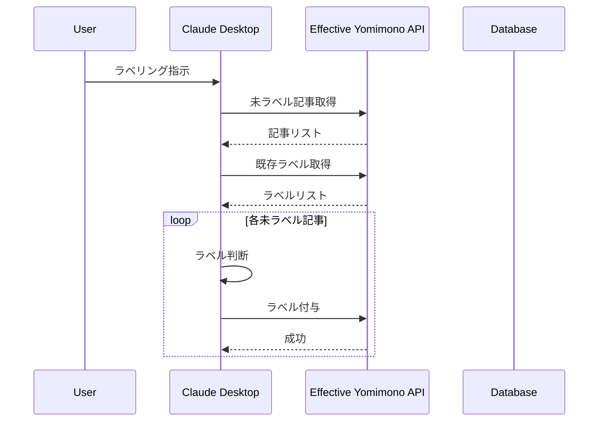

# ラベリング機能

## 概要

ラベリング機能は、保存された技術記事に対して Claude Desktop を活用した自動ラベル付けを行う機能です。ユーザーの指示に基づいてラベル未設定の記事に対してラベルを付与し、記事の整理と検索性を向上させます。

## 目的

1. **効率的な記事整理**: 
   - 手動でのラベル付け作業を排除
   - Claude Desktop の自然言語理解能力を活用した適切なラベリング
   - 表記揺れや類似ラベルの統一による一貫性維持

2. **記事管理の改善**:
   - ラベルによる記事の分類と整理
   - フィルタリングによる目的の記事の素早い発見
   - 関連記事の発見性向上

## 主要機能

1. **Claude Desktop からのラベリング実行**:
   - ユーザーがラベリングを指示
   - ラベル未設定の記事一覧と既存ラベル一覧を取得
   - 記事ごとに適切なラベルを判断・付与

2. **ラベル自動生成**:
   - 既存のラベルから最適なものを選択
   - 該当するラベルがない場合は新規ラベルを生成
   - 表記揺れや類似ラベルの統一を考慮

3. **フロントエンド表示**:
   - 記事一覧での各記事のラベル表示
   - ラベルによる記事のフィルタリング機能

## 技術アーキテクチャ

## データの流れ

1. **入力**:
   - Claude Desktop からのラベリング実行指示

2. **処理**:
   - 未ラベル記事とラベル一覧の取得
   - 記事ごとのラベル判断と付与
   - 必要に応じた新規ラベルの生成

3. **出力**:
   - 記事へのラベル付与結果
   - フロントエンドでのラベル表示とフィルタリング

## セキュリティと認証

- 個人利用を前提とした設計
- 初期段階では認証なしで実装
- 将来的にはCloudflare AccessとそのトークンによるAPI認証を検討

## 制約事項

1. **手動操作の制限**:
   - ユーザーによるラベルの手動追加・編集・削除は不可
   - すべてのラベリングはClaude Desktop経由で実行

2. **ラベル統一性**:
   - 表記揺れや類似ラベルは可能な限り統一
   - ラベル名の正規化処理（全角→半角、小文字化等）を実装

## 今後の展開

1. **認証機能の追加**:
   - Cloudflare Accessを活用した認証の実装
   - APIトークンによるセキュリティ強化

2. **ラベリングの最適化**:
   - ラベル付けの精度向上
   - 類似ラベル判定の改善
   - 新規ラベル生成ルールの調整
