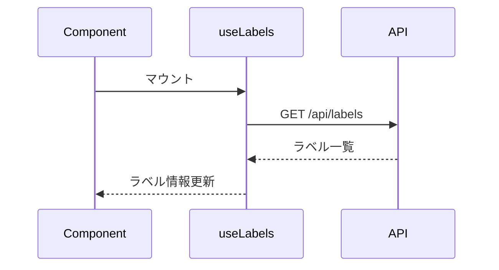
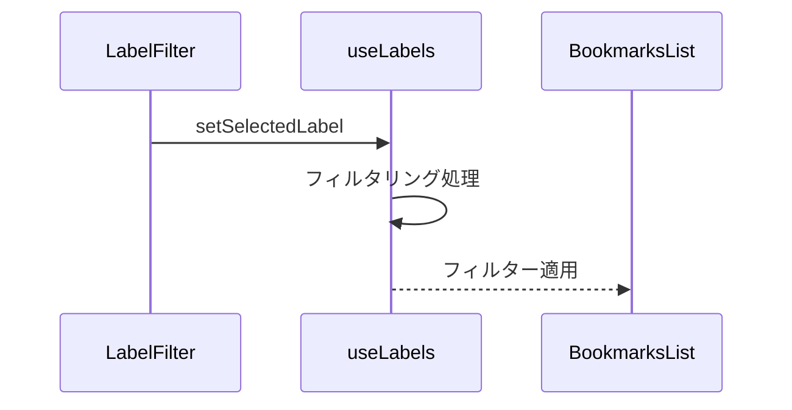

# フロントエンド設計

## コンポーネント構成

### 1. LabelDisplay
記事に付与されたラベルを表示するコンポーネント

```typescript
interface Props {
  label: Label;
  onClick?: () => void;
}

export function LabelDisplay({ label, onClick }: Props) {
  return (
    <button
      onClick={onClick}
      className="inline-flex items-center px-2.5 py-0.5 rounded-full text-xs font-medium bg-blue-100 text-blue-800 hover:bg-blue-200"
    >
      {label.name}
    </button>
  );
}
```

#### UI仕様
- スタイル：丸みを帯びたピル型デザイン
- サイズ：コンパクトで目立ちすぎない
- カラー
  - 背景：薄いブルー（hover時：やや濃いブルー）
  - テキスト：濃いブルー
- クリック時：ラベルでのフィルタリングを実行

### 2. BookmarkCard
記事カードにラベル表示を追加したコンポーネント

```typescript
interface Props {
  bookmark: BookmarkWithLabel;
}

export function BookmarkCard({ bookmark }: Props) {
  const { label } = bookmark;
  
  return (
    <div className="relative">
      {/* 既存の記事情報表示 */}
      {label && (
        <div className="absolute top-2 right-2">
          <LabelDisplay label={label} />
        </div>
      )}
    </div>
  );
}
```

#### レイアウト
- ラベル位置：カードの右上
- 既存のUI要素（タイトル、URL等）との整合性を維持
- レスポンシブ対応を継続

### 3. LabelFilter
ラベルによるフィルタリングUIコンポーネント

```typescript
interface Props {
  labels: Label[];
  selectedLabel?: string;
  onLabelSelect: (labelName: string | undefined) => void;
}

export function LabelFilter({
  labels,
  selectedLabel,
  onLabelSelect,
}: Props) {
  return (
    <div className="flex flex-wrap gap-2 mb-4">
      <button
        onClick={() => onLabelSelect(undefined)}
        className={`${
          !selectedLabel ? "bg-blue-500 text-white" : "bg-gray-100"
        } px-3 py-1 rounded-full text-sm`}
      >
        すべて
      </button>
      {labels.map((label) => (
        <button
          key={label.id}
          onClick={() => onLabelSelect(label.name)}
          className={`${
            selectedLabel === label.name
              ? "bg-blue-500 text-white"
              : "bg-gray-100"
          } px-3 py-1 rounded-full text-sm`}
        >
          {label.name}
          <span className="ml-1 text-xs">({label.articleCount})</span>
        </button>
      ))}
    </div>
  );
}
```

## データフロー

### 1. カスタムフック（useLabels）

```typescript
export function useLabels() {
  const [labels, setLabels] = useState<Label[]>([]);
  const [selectedLabel, setSelectedLabel] = useState<string>();
  const [isLoading, setIsLoading] = useState(false);

  // ラベル一覧の取得
  const fetchLabels = useCallback(async () => {
    try {
      setIsLoading(true);
      const response = await fetch("/api/labels");
      const data = await response.json();
      setLabels(data.labels);
    } catch (error) {
      console.error("Failed to fetch labels:", error);
    } finally {
      setIsLoading(false);
    }
  }, []);

  // 初期データの取得
  useEffect(() => {
    fetchLabels();
  }, [fetchLabels]);

  // ラベルによるフィルタリング
  const filteredArticles = useMemo(() => {
    if (!selectedLabel) return articles;
    return articles.filter((article) => 
      article.label?.name === selectedLabel
    );
  }, [articles, selectedLabel]);

  return {
    labels,
    selectedLabel,
    setSelectedLabel,
    isLoading,
    filteredArticles,
  };
}
```

### 2. 状態管理フロー

1. ラベル表示と一覧取得


2. ラベルフィルタリング


## エラーハンドリング

1. API通信エラー
- エラーメッセージのコンソール出力
- UIへの影響を最小限に抑制
- 必要に応じて再取得を実行

2. データ不整合
- 存在しないラベルの扱い
- ラベルなし記事の表示方法
- フィルタリング時の例外処理

## パフォーマンス最適化

1. メモ化による最適化
- useMemoによるフィルタリング結果のキャッシュ
- useCallbackによるコールバック関数の最適化
- 必要最小限の依存配列の設定

2. レンダリングの最適化
- コンポーネントの適切な分割
- 状態更新の影響範囲の最小化
- 必要な場合のみの再描画

## アクセシビリティ

1. セマンティックなHTML
- 適切なaria属性の使用
- キーボード操作のサポート
- フォーカス管理の実装

2. 視覚的な考慮
- 十分なコントラスト比の確保
- ホバー状態の視認性
- 選択状態の明確な表示

## 今後の拡張性

1. 機能拡張の余地
- ラベルの色分け機能
- ラベルによる並び替え
- ラベル統計情報の表示

2. UIの改善可能性
- ラベル選択UIの改善
- フィルター条件の複合化
- アニメーションの追加
