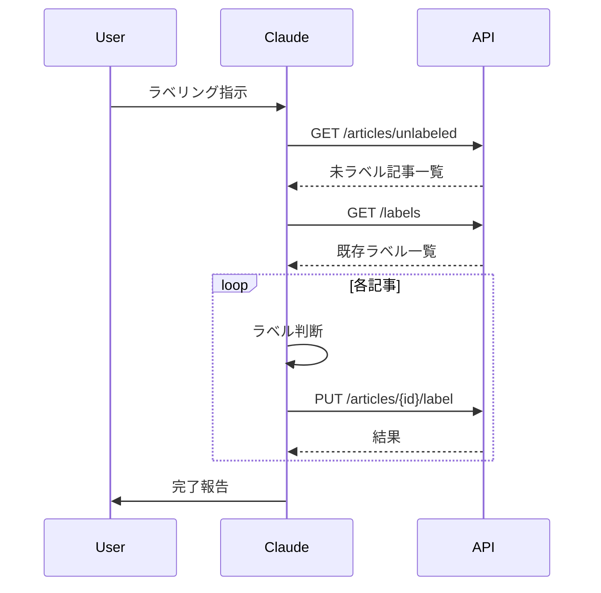

# Claude Desktop連携

## 概要

ラベリング機能は、Claude Desktopを活用して技術記事の自動ラベル付けを行います。本ドキュメントでは、Claude Desktopとの連携方法、特にプロンプトの設計とAPIの利用方法について説明します。

## 連携フロー



## プロンプト設計

### 1. 基本プロンプト

```
あなたは技術記事のラベリングを行うアシスタントです。
以下のAPIを利用して、未ラベル記事に対して適切なラベルを付与してください。

使用可能なAPI:
1. GET /api/articles/unlabeled - 未ラベル記事の取得
2. GET /api/labels - 既存ラベル一覧の取得
3. PUT /api/articles/{id}/label - ラベルの付与

ラベリングのルール:
- 記事のタイトルから技術的なトピックを判断
- 既存のラベルに適切なものがあれば優先的に使用
- 新しいラベルを作成する場合は、表記揺れや類似ラベルに注意
- ラベル名は英数字の小文字を使用

それでは、ラベリング作業を開始してください。
```

### 2. ラベル判断のためのプロンプト例

```
以下の記事に最適なラベルを選択または作成してください。

記事情報:
タイトル: {title}
URL: {url}

既存のラベル一覧:
{labels}

判断基準:
1. タイトルから主要な技術トピックを識別
2. 既存ラベルに適切なものがあれば使用
3. 新規ラベルが必要な場合は、簡潔で汎用的な名前を考案
4. 表記揺れや類似ラベルを避ける

ラベルを1つ選択または提案してください。
```

## APIの利用方法

### 1. 未ラベル記事の取得

```typescript
const response = await fetch("/api/articles/unlabeled");
const { articles } = await response.json();
```

### 2. 既存ラベルの取得

```typescript
const response = await fetch("/api/labels");
const { labels } = await response.json();
```

### 3. ラベルの付与

```typescript
const response = await fetch(`/api/articles/${articleId}/label`, {
  method: "PUT",
  headers: {
    "Content-Type": "application/json",
  },
  body: JSON.stringify({
    labelName: decidedLabel,
  }),
});
```

## MCPツール一覧

### 1. getUnlabeledArticles
未ラベルの記事一覧を取得します。

```typescript
// 引数なし
const result = await callTool("getUnlabeledArticles");
```

### 2. getLabels
既存のラベル一覧を取得します。

```typescript
// 引数なし
const result = await callTool("getLabels");
```

### 3. assignLabel
記事にラベルを付与します。

```typescript
const result = await callTool("assignLabel", {
  articleId: 1,
  labelName: "typescript"
});
```

## エラー処理

### 1. API通信エラー
- ネットワークエラーの場合は再試行
- サーバーエラーの場合はスキップして次の記事へ

### 2. ラベル判断エラー
- タイトルから判断できない場合はスキップ
- 既存ラベルとの類似性判断が困難な場合は手動でラベルを整備

## 表記揺れ対策

### 1. 正規化ルール
- 全角英数字は半角に変換
- スペースは除去
- 小文字に統一
- 特殊文字は除去

### 2. 類似性判断の例
```
typescript ≒ ts
javascript ≒ js
python3 ≒ python
react.js ≒ react
```

## パフォーマンス考慮

### 1. バッチ処理
- 一度に処理する記事数を制限
- APIリクエストの間隔を適切に設定

### 2. エラー時の継続性
- 1つの記事の失敗が全体の処理を停止しないよう考慮
- エラーログを適切に記録

## 今後の改善案

1. **判断精度の向上**
   - URL先の記事内容も考慮したラベリング
   - 複数の候補からの選択機能

2. **効率化**
   - バッチサイズの最適化
   - 並列処理の検討

3. **ラベル管理の改善**
   - 類似ラベルの統合機能
   - ラベルの階層構造化検討
