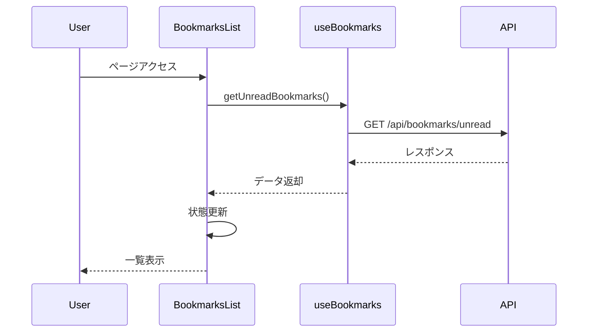
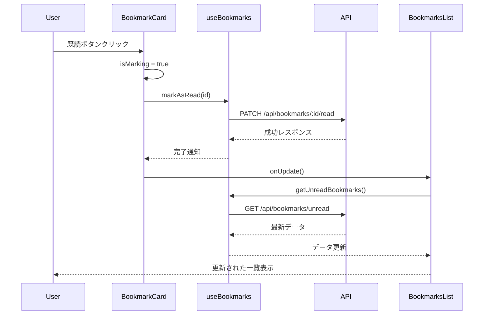
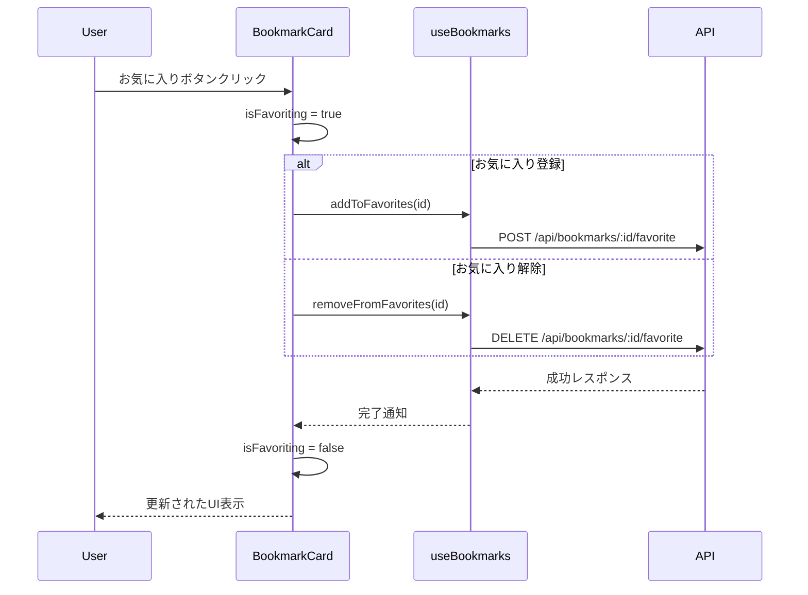

# 未読記事一覧のフロントエンド設計

## コンポーネント構成

未読記事一覧機能は、以下のコンポーネントで構成されています。

### 1. BookmarksList コンポーネント

未読ブックマークの一覧を表示する主要コンポーネントです。

**役割**:
- 未読ブックマークデータの取得と表示
- 未読記事数と当日読了数の表示
- 更新ボタンの提供
- ローディング状態とエラー状態の管理

**プロパティ**:
```typescript
interface BookmarksListProps {
  initialBookmarks?: Bookmark[];
  mode?: "all" | "favorites";
}
```

**状態管理**:
```typescript
const [bookmarks, setBookmarks] = useState<Bookmark[]>(initialBookmarks);
const [totalUnread, setTotalUnread] = useState<number>(0);
const [todayReadCount, setTodayReadCount] = useState<number>(0);
const [isLoading, setIsLoading] = useState(false);
const [error, setError] = useState<string | null>(null);
const [displayData, setDisplayData] = useState<Bookmark[]>([]);
```

**主要メソッド**:
- `fetchBookmarks()`: APIから未読ブックマークデータを取得
- `handleUpdate()`: 表示モードに応じたデータ更新処理

### 2. BookmarkCard コンポーネント

個々のブックマークを表示するカードコンポーネントです。

**役割**:
- ブックマーク情報（タイトル、URL、日付）の表示
- お気に入り登録/解除機能の提供
- Xでのシェア機能の提供
- 既読マーク機能の提供

**プロパティ**:
```typescript
interface Props {
  bookmark: Bookmark;
  onUpdate?: () => void;
}
```

**状態管理**:
```typescript
const [isFavoriting, setIsFavoriting] = useState(false);
const [isMarking, setIsMarking] = useState(false);
```

**主要メソッド**:
- `handleFavoriteToggle()`: お気に入り状態の切り替え
- `handleShare()`: Xでのシェア処理
- `handleMarkAsRead()`: 既読状態への更新

### 3. useBookmarks カスタムフック

ブックマーク関連のAPI操作を提供するカスタムフックです。

**役割**:
- APIとの通信処理のカプセル化
- ブックマーク操作のための統一インターフェース提供
- エラーハンドリングの一元管理

**提供する機能**:
```typescript
return {
  getUnreadBookmarks,
  markAsRead,
  addToFavorites,
  removeFromFavorites,
  favorites,
  isLoading,
  fetchFavorites,
};
```

## UI設計

### 1. 未読記事一覧画面

**レイアウト**:
```
+------------------------------------------+
| [ヘッダー]                               |
+------------------------------------------+
| 未読ブックマーク [10件] [今日5件読了] [更新]|
|                                          |
| +--------+  +--------+  +--------+       |
| |カード1  |  |カード2  |  |カード3  |       |
| |        |  |        |  |        |       |
| |        |  |        |  |        |       |
| +--------+  +--------+  +--------+       |
|                                          |
| +--------+  +--------+  +--------+       |
| |カード4  |  |カード5  |  |カード6  |       |
| |        |  |        |  |        |       |
| |        |  |        |  |        |       |
| +--------+  +--------+  +--------+       |
+------------------------------------------+
```

**レスポンシブ対応**:
- モバイル: 1列表示
- タブレット: 2列表示
- デスクトップ: 4列表示

### 2. ブックマークカード

**レイアウト**:
```
+----------------------------------+
| タイトル                         |
| URL                              |
| 日付                             |
|                                  |
|                      [★][X][✓]  |
+----------------------------------+
```

**状態表示**:
- 通常状態: グレーのアウトライン
- お気に入り状態: 黄色の星アイコン
- 処理中: ローディングアニメーション

## インタラクション設計

### 1. 初期ロード



### 2. 既読マーク処理



### 3. お気に入り処理



## スタイリング

TailwindCSSを使用して以下のスタイリングを適用しています。

### BookmarksList

- グリッドレイアウト: `grid gap-4 sm:grid-cols-1 md:grid-cols-2 lg:grid-cols-4`
- タイトル: `text-2xl font-bold`
- カウンターバッジ: `px-2 py-1 bg-blue-100 text-blue-800 text-sm font-semibold rounded-full`
- 更新ボタン: `inline-flex items-center px-4 py-2 border border-transparent text-sm font-medium rounded-md text-white bg-blue-600 hover:bg-blue-700`
- ローディング表示: `animate-spin h-8 w-8 border-4 border-blue-500 border-t-transparent rounded-full`

### BookmarkCard

- カード: `p-4 border rounded-lg hover:shadow-md transition-shadow flex flex-col min-h-[150px]`
- タイトル: `font-bold mb-2 line-clamp-2`
- URL: `text-sm text-gray-600 line-clamp-1 mb-2`
- 日付: `text-xs text-gray-500`
- アクションボタン: `absolute bottom-2 right-[n] p-1 rounded-full`

## パフォーマンス最適化

- `useCallback` を使用した関数の最適化
- 条件付きレンダリングによる不要な再描画の防止
- エラー状態の適切な管理
- ローディング状態の視覚的フィードバック

## アクセシビリティ

- セマンティックなHTML要素の使用（article, h2など）
- ボタンへのタイトル属性の追加
- フォーカス可能な要素の適切な管理
- 色のコントラスト比の確保
