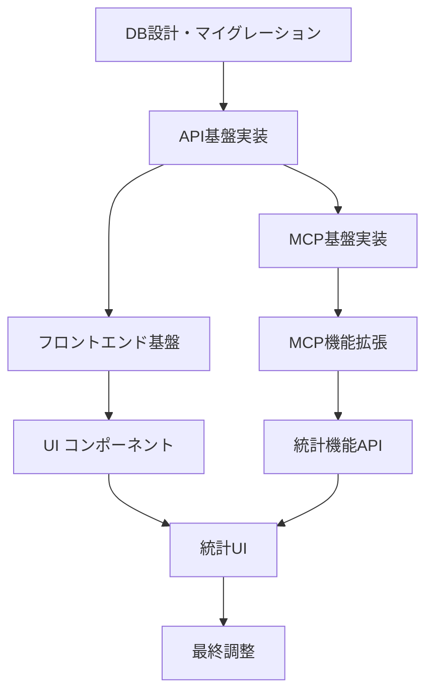

# 記事評価ポイント機能 - 実装計画

## 1. 実装フェーズ分割

### Phase 1: 基盤構築 (2週間)
**目標**: 最小限の評価機能の実装

#### 1.1 データベース設計・構築
- [ ] `article_ratings` テーブル作成
- [ ] マイグレーションファイル作成
- [ ] トリガー設定（総合スコア自動計算）
- [ ] インデックス設定

#### 1.2 API基盤実装
- [ ] 評価作成エンドポイント (`POST /api/bookmarks/{id}/rating`)
- [ ] 評価取得エンドポイント (`GET /api/bookmarks/{id}/rating`)
- [ ] 基本的なバリデーション
- [ ] エラーハンドリング

#### 1.3 MCP基盤実装
- [ ] `rateArticle` ツール実装
- [ ] `getArticleRating` ツール実装
- [ ] APIクライアント拡張
- [ ] 基本的なテスト作成

**成果物**: 
- MCPで記事評価の追加・取得が可能
- APIでの基本的な評価操作が可能

### Phase 2: MCP機能完成 (1週間)
**目標**: MCPツールの完全実装

#### 2.1 MCP機能拡張
- [ ] `updateArticleRating` ツール実装
- [ ] `getArticleRatings` ツール実装（一覧取得）
- [ ] ソート・フィルター機能
- [ ] エラーハンドリング強化

#### 2.2 API機能拡張
- [ ] 評価更新エンドポイント (`PATCH /api/bookmarks/{id}/rating`)
- [ ] 評価一覧エンドポイント (`GET /api/ratings`)
- [ ] 詳細なバリデーション
- [ ] パフォーマンス最適化

#### 2.3 テスト強化
- [ ] 包括的なユニットテスト
- [ ] 統合テスト
- [ ] MCPツールテスト

**成果物**:
- 完全機能のMCPサーバー
- 信頼性の高いAPI

### Phase 3: フロントエンド基本実装 (2週間)
**目標**: 基本的なUI実装

#### 3.1 コンポーネント実装
- [ ] `StarRating` コンポーネント
- [ ] `RatingModal` コンポーネント
- [ ] `BookmarkCard` 拡張（評価表示）
- [ ] 基本的なスタイリング

#### 3.2 React Query統合
- [ ] 評価取得hooks
- [ ] 評価作成・更新hooks
- [ ] キャッシュ戦略実装
- [ ] エラーハンドリング

#### 3.3 画面統合
- [ ] メインページでの評価表示
- [ ] 評価モーダルの統合
- [ ] 基本的なソート機能

**成果物**:
- ブックマークカードでの評価表示
- 評価追加・編集機能

### Phase 4: 高度なUI機能 (1.5週間)
**目標**: 分析・統計機能の実装

#### 4.1 統計機能実装
- [ ] 評価統計API (`GET /api/ratings/stats`)
- [ ] `RatingStats` コンポーネント
- [ ] グラフ・チャート表示
- [ ] 統計ページ作成

#### 4.2 フィルター・ソート強化
- [ ] 詳細なフィルター機能
- [ ] 複数軸でのソート
- [ ] 検索機能統合

#### 4.3 UX改善
- [ ] レスポンシブ対応
- [ ] アクセシビリティ対応
- [ ] パフォーマンス最適化

**成果物**:
- 評価分析画面
- 高度なフィルター・ソート機能

### Phase 5: 最終調整・最適化 (0.5週間)
**目標**: 品質向上・デプロイ準備

#### 5.1 品質向上
- [ ] E2Eテスト作成
- [ ] パフォーマンステスト
- [ ] セキュリティチェック
- [ ] バグ修正

#### 5.2 ドキュメント整備
- [ ] ユーザーマニュアル
- [ ] API仕様書更新
- [ ] 運用マニュアル

**成果物**:
- 本番デプロイ可能な品質
- 完全なドキュメント

## 2. 技術的依存関係

### 2.1 開発順序

### 2.2 並行開発可能な部分

- **API開発** と **MCP開発** は部分的に並行可能
- **コンポーネント開発** は API仕様確定後に並行可能
- **テスト作成** は各モジュール完成後すぐに並行実行

## 3. リソース計画

### 3.1 開発体制

| 役割 | フェーズ1 | フェーズ2 | フェーズ3 | フェーズ4 | フェーズ5 |
|------|----------|----------|----------|----------|----------|
| **バックエンド** | 🔴 DB+API | 🔴 API拡張 | 🟡 サポート | 🔴 統計API | 🟡 品質向上 |
| **MCP開発** | 🔴 基盤 | 🔴 機能完成 | 🟡 サポート | - | 🟡 テスト |
| **フロントエンド** | - | 🟡 準備 | 🔴 基本UI | 🔴 高度UI | 🟡 最適化 |
| **テスト** | 🟡 基本 | 🔴 包括 | 🔴 UI | 🔴 E2E | 🔴 品質保証 |

**凡例**: 🔴 = メイン担当, 🟡 = サポート・並行作業

### 3.2 マイルストーン

#### マイルストーン 1 (2週間後)
- **達成目標**: MCPでの記事評価機能が動作
- **検証方法**: Claude Desktopで記事評価が追加・取得できる
- **成功基準**: 
  - 5軸評価の入力・保存
  - 総合スコアの自動計算
  - エラーハンドリング

#### マイルストーン 2 (3週間後)
- **達成目標**: MCP機能の完全実装
- **検証方法**: 全MCPツールが正常動作
- **成功基準**:
  - 評価一覧取得・ソート
  - 評価更新機能
  - 包括的なテストカバレッジ

#### マイルストーン 3 (5週間後)
- **達成目標**: 基本UI機能の実装
- **検証方法**: Webブラウザで評価機能が利用可能
- **成功基準**:
  - ブックマークカードでの評価表示
  - 評価モーダルでの入力・編集
  - React Query統合

#### マイルストーン 4 (6.5週間後)
- **達成目標**: 高度な分析機能の実装
- **検証方法**: 統計ページでの分析表示
- **成功基準**:
  - 評価統計の可視化
  - 高度なフィルター・ソート
  - レスポンシブ対応

#### ファイナル (7週間後)
- **達成目標**: 本番デプロイ準備完了
- **検証方法**: 全機能の結合テスト通過
- **成功基準**:
  - E2Eテスト通過
  - パフォーマンス要件満たす
  - セキュリティチェック完了

## 4. リスク管理

### 4.1 技術的リスク

| リスク | 影響度 | 対策 |
|--------|--------|------|
| **DB性能問題** | 中 | 適切なインデックス設計、クエリ最適化 |
| **MCP統合の複雑性** | 中 | シンプルなAPI設計、段階的実装 |
| **フロントエンド複雑化** | 低 | コンポーネント設計の事前検討 |
| **評価データ量増大** | 低 | ページング、アーカイブ戦略 |

### 4.2 スケジュールリスク

| リスク | 対策 |
|--------|------|
| **Phase 1遅延** | API設計の事前詳細化、自動テスト早期導入 |
| **UI実装遅延** | コンポーネント仕様の事前確定、デザインシステム活用 |
| **統合テスト遅延** | 段階的統合、CI/CD自動化 |

### 4.3 品質リスク

| リスク | 対策 |
|--------|------|
| **データ整合性** | トランザクション適切使用、制約設定 |
| **UX問題** | プロトタイプでの事前検証、ユーザビリティテスト |
| **パフォーマンス** | 継続的監視、ボトルネック早期発見 |

## 5. 成功指標 (KPI)

### 5.1 技術指標

- **API応答時間**: 95%のリクエストが200ms以内
- **テストカバレッジ**: 85%以上
- **バグ発生率**: 週次リリースで重大バグ0件
- **MCP応答率**: 99%以上の成功率

### 5.2 機能指標

- **評価完了率**: ブックマーク作成から1週間以内に30%
- **評価更新率**: 初回評価から1ヶ月以内に10%
- **統計ページ利用率**: MAU (月間アクティブユーザー) の20%
- **機能採用率**: 全ユーザーの70%が1ヶ月以内に評価機能を利用

### 5.3 品質指標

- **エラー率**: 全API呼び出しの1%未満
- **ページ表示速度**: LCP (Largest Contentful Paint) 2.5秒以内
- **アクセシビリティ**: WCAG 2.1 AA準拠
- **モバイル対応**: Core Web Vitals 全項目Good

## 6. 運用・保守計画

### 6.1 監視項目

- **データベース**: クエリ性能、容量使用率
- **API**: レスポンス時間、エラー率、使用量
- **フロントエンド**: ページ表示速度、JavaScript エラー
- **MCP**: ツール使用頻度、エラー率

### 6.2 バックアップ・復旧

- **データ**: 日次自動バックアップ
- **設定**: 構成管理による復旧手順
- **災害対策**: RTO (目標復旧時間) 4時間以内

### 6.3 将来拡張の準備

- **新評価軸の追加**: テーブル設計での対応
- **AI分析機能**: 評価データの機械学習基盤
- **他サービス連携**: API設計での外部連携考慮
- **マルチユーザー対応**: 将来的な認証・認可機能