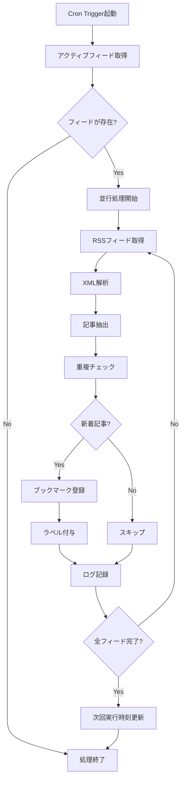

# RSS読み込み機能バッチ処理設計

## バッチ処理概要

### 目的
- 登録されたRSSフィードから定期的に新着記事を取得
- 取得した記事を自動的にブックマークとして登録
- システムの負荷を分散しながら効率的に処理

### 実行方式
- Cloudflare Workersの[Cron Triggers](https://developers.cloudflare.com/workers/platform/cron-triggers/)を使用
- デフォルトは1時間毎の実行
- フィード毎に個別の実行間隔を設定可能

## バッチ処理アーキテクチャ

### Workerの構成
```
[Cron Trigger] 
    ↓
[RSS Batch Worker]
    ├─ [Feed Fetcher] (並行処理)
    ├─ [XML Parser]
    ├─ [Article Processor]
    └─ [Database Writer]
```

### 処理フロー


## 詳細設計

### 1. Cron設定
```javascript
// wrangler.toml
[triggers]
crons = [
  "0 * * * *", // 毎時0分に実行
]

// alternate patterns
// "*/30 * * * *" - 30分毎
// "0 */2 * * *" - 2時間毎
// "0 0,12 * * *" - 1日2回（0時、12時）
```

### 2. メインバッチ処理
```typescript
export interface Env {
  DB: D1Database;
  RSS_BATCH_QUEUE: Queue;
}

export default {
  async scheduled(
    controller: ScheduledController,
    env: Env,
    ctx: ExecutionContext
  ): Promise<void> {
    // バッチ処理のメインロジック
    const batchProcessor = new RSSBatchProcessor(env.DB);
    
    try {
      // アクティブなフィードを取得
      const activeFeeds = await batchProcessor.getActiveFeeds();
      
      // 並行処理の設定
      const CONCURRENT_LIMIT = 10;
      const chunks = chunk(activeFeeds, CONCURRENT_LIMIT);
      
      // チャンク毎に処理
      for (const feedChunk of chunks) {
        await Promise.all(
          feedChunk.map(feed => processFeed(feed, env))
        );
      }
      
      // バッチ完了ログ
      await batchProcessor.logBatchComplete();
      
    } catch (error) {
      console.error('Batch processing error:', error);
      await batchProcessor.logBatchError(error);
    }
  }
} satisfies ExportedHandler<Env>;
```

### 3. フィード処理
```typescript
async function processFeed(
  feed: RSSFeed, 
  env: Env
): Promise<void> {
  const processor = new FeedProcessor(feed, env.DB);
  
  try {
    // フィード取得
    const feedData = await fetchFeed(feed.url);
    
    // XML解析
    const articles = await parseFeed(feedData);
    
    // 新着記事のフィルタリング
    const newArticles = await processor.filterNewArticles(articles);
    
    // ブックマーク登録
    const savedCount = await processor.saveArticles(newArticles);
    
    // 成功ログ
    await processor.logSuccess(savedCount);
    
  } catch (error) {
    // エラーログ
    await processor.logError(error);
    
    // リトライが必要な場合
    if (shouldRetry(error)) {
      await scheduleRetry(feed, env);
    }
  }
}
```

### 4. RSSフィード取得とパース
```typescript
async function fetchFeed(url: string): Promise<string> {
  const response = await fetch(url, {
    headers: {
      'User-Agent': 'Yomimono RSS Reader 1.0',
      'Accept': 'application/rss+xml, application/xml, text/xml',
    },
    cf: {
      cacheEverything: true,
      cacheTtl: 300, // 5分間キャッシュ
    },
  });
  
  if (!response.ok) {
    throw new Error(`Failed to fetch RSS: ${response.status}`);
  }
  
  return response.text();
}

async function parseFeed(feedData: string): Promise<Article[]> {
  const parser = new XMLParser({
    ignoreAttributes: false,
    parseAttributeValue: true,
  });
  
  const result = parser.parse(feedData);
  
  // RSS 2.0形式
  if (result.rss?.channel) {
    return parseRSS2(result.rss.channel);
  }
  
  // Atom形式
  if (result.feed) {
    return parseAtom(result.feed);
  }
  
  throw new Error('Unsupported feed format');
}
```

### 5. 記事処理とデータベース保存
```typescript
class FeedProcessor {
  constructor(
    private feed: RSSFeed,
    private db: D1Database
  ) {}
  
  async filterNewArticles(articles: Article[]): Promise<Article[]> {
    // 最終取得日時以降の記事を抽出
    const lastFetch = this.feed.lastFetchedAt;
    const newArticles = articles.filter(article => 
      !lastFetch || article.publishedAt > lastFetch
    );
    
    // URL重複チェック
    const existingUrls = await this.getExistingUrls(
      newArticles.map(a => a.url)
    );
    
    return newArticles.filter(article => 
      !existingUrls.includes(article.url)
    );
  }
  
  async saveArticles(articles: Article[]): Promise<number> {
    let savedCount = 0;
    
    // トランザクション処理
    await this.db.batch(articles.map(article => {
      const bookmark = {
        url: article.url,
        title: article.title,
        isRead: false,
        sourceType: 'rss',
        createdAt: article.publishedAt || new Date(),
      };
      
      return this.db
        .prepare('INSERT INTO bookmarks (url, title, is_read, source_type, created_at) VALUES (?, ?, ?, ?, ?)')
        .bind(bookmark.url, bookmark.title, bookmark.isRead, bookmark.sourceType, bookmark.createdAt);
    }));
    
    // RSS記事情報の保存
    for (const article of articles) {
      const bookmarkId = await this.getBookmarkId(article.url);
      
      await this.saveRSSItem({
        feedId: this.feed.id,
        guid: article.guid,
        url: article.url,
        title: article.title,
        description: article.description,
        publishedAt: article.publishedAt,
        bookmarkId,
      });
      
      // 自動ラベル付与
      await this.applyLabels(bookmarkId);
      
      savedCount++;
    }
    
    return savedCount;
  }
  
  async applyLabels(bookmarkId: number): Promise<void> {
    // RSS共通ラベル
    await this.addLabel(bookmarkId, 'RSS');
    
    // フィード固有のラベル
    const feedLabels = await this.getFeedLabels();
    for (const label of feedLabels) {
      await this.addLabel(bookmarkId, label.name);
    }
  }
}
```

### 6. エラーハンドリングとリトライ
```typescript
function shouldRetry(error: Error): boolean {
  // ネットワークエラーや一時的なエラーの場合リトライ
  const retryableErrors = [
    'NetworkError',
    'TimeoutError',
    'TemporaryError',
  ];
  
  return retryableErrors.some(type => 
    error.message.includes(type)
  );
}

async function scheduleRetry(
  feed: RSSFeed, 
  env: Env
): Promise<void> {
  // 指数バックオフでリトライ
  const retryCount = feed.retryCount || 0;
  const delay = Math.min(
    300 * Math.pow(2, retryCount), // 5分から開始
    3600 // 最大1時間
  );
  
  await env.RSS_BATCH_QUEUE.send({
    feedId: feed.id,
    retryCount: retryCount + 1,
    scheduledAt: Date.now() + delay * 1000,
  });
}
```

### 7. ログ記録
```typescript
class BatchLogger {
  constructor(private db: D1Database) {}
  
  async logFeedProcess(
    feedId: number,
    status: 'success' | 'error',
    details: {
      itemsFetched: number;
      itemsCreated: number;
      errorMessage?: string;
      duration: number;
    }
  ): Promise<void> {
    await this.db
      .prepare(`
        INSERT INTO rss_batch_logs 
        (feed_id, status, items_fetched, items_created, error_message, started_at, finished_at) 
        VALUES (?, ?, ?, ?, ?, ?, ?)
      `)
      .bind(
        feedId,
        status,
        details.itemsFetched,
        details.itemsCreated,
        details.errorMessage || null,
        new Date(Date.now() - details.duration),
        new Date()
      )
      .run();
  }
}
```

## パフォーマンス考慮事項

### 1. 並行処理
- 最大10フィードを同時処理
- フィード毎の処理時間上限30秒
- メモリ使用量の監視

### 2. キャッシュ戦略
- Cloudflare Cacheを活用
- RSSフィードの5分間キャッシュ
- 重複チェックのキャッシュ

### 3. エラー時の継続性
- 1フィードのエラーが他に影響しない
- 部分的な成功を許容
- エラー情報の詳細記録

## 監視とメンテナンス

### 1. メトリクス収集
- 実行時間
- 成功/失敗率
- 取得記事数
- エラー分類

### 2. アラート設定
- 連続失敗時の通知
- 異常な処理時間の検知
- ディスク容量の監視

### 3. デバッグ支援
- 詳細なログ出力
- 手動実行機能
- ドライラン機能

## 将来の拡張性

### 1. スケーラビリティ
- Queue APIによる非同期処理
- Durable Objectsによる状態管理
- 複数Worker間での負荷分散

### 2. 機能拡張
- 記事内容の自動分類
- 重要度判定
- 既読予測

### 3. 統合可能性
- Webhookトリガー
- 外部サービス連携
- イベント駆動処理